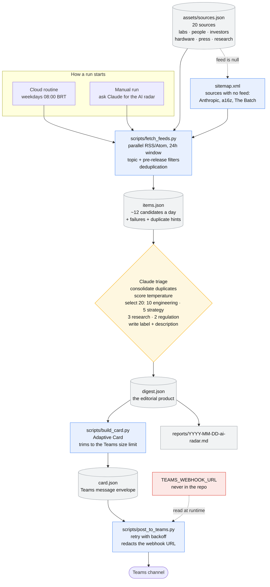

# claude-labs

A lab for Claude Code experiments. It currently holds one thing: **`ai-news-digest`**,
a daily radar on **software engineering with AI**, written for SiDi's AI strategy
committee.

Every weekday morning it collects the last 24 hours from a deliberately small catalog of 20 sources, judges how
much each item matters, keeps the 20 that matter most, and publishes them as a
card newsletter in a Microsoft Teams channel.

The catalog has two tiers. **Primary:** the labs (OpenAI, Anthropic, Google), the
people building them, investors, and NVIDIA. **Supporting:** press, engineering
and research sources, because the primary tier cannot report on itself — the labs
announce but do not analyse, the people publish on X which has no fetchable feed,
and the VC firms blog about portfolio companies rather than deals.

## Sources

The catalog as it stands, with what each source actually delivered. **d-1** is
the last 24 hours, **d-7** the last 7 days, both measured on 2026-09-03 and both
counted before deduplication — the same story from four outlets counts four
times here and becomes one card.

| `id`               | Name                                    | Category    | How it is read          | d-1    | d-7     |
| ------------------ | --------------------------------------- | ----------- | ----------------------- | ------ | ------- |
| `openai`           | OpenAI News                             | lab         | RSS/Atom                | 4      | 14      |
| `anthropic`        | Anthropic News                          | lab         | Sitemap                 | 0      | 6       |
| `deepmind`         | Google DeepMind Blog                    | lab         | RSS/Atom                | 1      | 4       |
| `google-ai`        | Google - The Keyword (AI)               | lab         | RSS/Atom                | 0      | 3       |
| `karpathy`         | Andrej Karpathy                         | people      | RSS/Atom                | 0      | 0       |
| `boris-cherny`     | Boris Cherny                            | people      | RSS/Atom                | 0      | 0       |
| `thariq`           | Thariq Shihipar                         | people      | RSS/Atom                | 0      | 0       |
| `the-batch`        | The Batch (Andrew Ng / DeepLearning.AI) | people      | Sitemap                 | 0      | 7       |
| `sam-altman`       | Sam Altman                              | people      | RSS/Atom                | 0      | 0       |
| `a16z`             | Andreessen Horowitz                     | investor    | Sitemap                 | 0      | 0       |
| `ycombinator`      | Y Combinator Blog                       | investor    | RSS/Atom                | 0      | 0       |
| `sequoia`          | Sequoia Capital                         | investor    | RSS/Atom                | 0      | 0       |
| `nvidia`           | NVIDIA Blog                             | hardware    | RSS/Atom + topic filter | 2      | 3       |
| `nvidia-newsroom`  | NVIDIA Newsroom                         | hardware    | RSS/Atom + topic filter | 2      | 4       |
| `techcrunch-ai`    | TechCrunch AI                           | press       | RSS/Atom                | 7      | 19      |
| `the-decoder`      | The Decoder                             | press       | RSS/Atom                | 8      | 10      |
| `arstechnica-ai`   | Ars Technica AI                         | press       | RSS/Atom                | 2      | 10      |
| `latent-space`     | Latent Space                            | engineering | RSS/Atom                | 2      | 7       |
| `arxiv-se`         | arXiv cs.SE (Software Engineering)      | research    | RSS/Atom                | 10*    | 10*     |
| `github-changelog` | GitHub Changelog                        | engineering | RSS/Atom + topic filter | 3      | 5       |
| **Total**          | **20 sources**                          |             |                         | **41** | **102** |

`*` capped by the source's own `max_items`; arXiv cs.SE publishes far more than
10 a day and is deliberately held there.

The counts are a snapshot and drift. To take a fresh one:

```bash
python3 scripts/fetch_feeds.py --hours 24  --out /tmp/d1.json
python3 scripts/fetch_feeds.py --hours 168 --out /tmp/d7.json
# per source: sources_ok[].in_window in each file
```

**The engineering share is not covered by this catalog.** The lens table asks for
ten engineering cards of twenty; the two engineering sources supplied 5 items in
the last 24h and 12 in the week. The gap has to be closed either by the press
(judged by lens — a coding-agent pricing change is engineering wherever it was
reported) or by adding sources. The backlog item in `CLAUDE.md` lists the
reachable candidates: Simon Willison's `ai-assisted-programming` tag, Sourcegraph,
JetBrains AI, the MCP spec, InfoQ, the Pragmatic Engineer, Martin Fowler and
Cursor's changelog — none of them a GitHub release feed, which the sandbox blocks.

Two more things the numbers say plainly. **The people and the investors publish
almost nothing**: seven of the twenty sources returned zero in a full week,
because Karpathy, Boris Cherny, Thariq and Sam Altman post on X, which has no
fetchable feed, and the VC firms blog about portfolio companies rather than
deals. They stay in the catalog because when they do publish it is first-hand,
and they cost nothing on a quiet day. **The press carries the volume**:
TechCrunch, The Decoder and Ars Technica together are 39 of the 102 items in a
week.

The three sitemap sources publish no RSS at all and are read from
`sitemap.xml`; the topic filter is what keeps NVIDIA's gaming beat and
GitHub's non-AI changelog out. `references/sources.md` has the reasoning per
source, and how to add or fix one.

## Solution overview



The three blue boxes are deterministic Python. The yellow diamond is the only
step that needs judgment, and it is where Claude does the actual editorial work:
merging the same story across outlets and languages, deciding what is hot, and
writing each card. Everything around it is plumbing that either succeeds or
reports why it failed.

## Repository layout

| Path | What it is |
| --- | --- |
| `CLAUDE.md` | Project instructions Claude loads every session: what the skill is, the rules that must hold when changing it, the activation checklist, and the backlog. |
| `README.md` | This file. |
| `reports/` | Archive of published newsletters, one file per day as `YYYY-MM-DD-ai-radar.md`. What goes to Teams is the Adaptive Card; this is the readable record of it, because a Teams card stops being searchable after a few weeks. |
| `.claude/skills/ai-news-digest/` | The skill itself. |

### Inside the skill

| Path | What it is |
| --- | --- |
| `SKILL.md` | The entry point. Claude reads this to run the newsletter: the seven-step flow, the temperature rubric, the four committee lenses, and the writing rules. Everything else in the folder is referenced from here. |
| `assets/sources.json` | The source catalog, the base of truth for everything else in this repo, and the file you edit most. Each entry carries a feed or a sitemap, a weight, a language, and optional flags. `lang` decides the card's language; `kind: release` marks a version feed. When it changes, `CLAUDE.md`, this file, `SKILL.md` and `references/sources.md` change with it. |
| `assets/report-template.md` | Shape of the markdown newsletter archived in `reports/`. |
| `scripts/fetch_feeds.py` | Collector. Fetches every feed in parallel, filters to the time window, drops off-topic items from general sources and alpha/beta/nightly builds from release feeds, deduplicates, and reports every failure. Standard library only. |
| `scripts/build_card.py` | Renderer. Turns `digest.json` into a Teams Adaptive Card, validates the digest, and drops the coldest items if the card would exceed the Teams size limit. |
| `scripts/post_to_teams.py` | Publisher. POSTs to the channel webhook with retry and backoff, and redacts the URL from every line it prints. |
| `references/digest-schema.md` | The contract between triage and rendering: what `digest.json` must contain and how it is validated. |
| `references/sources.md` | Why each source is on the list, how to fix a feed that moved, and how deduplication actually behaves. |
| `references/teams-delivery.md` | How to create the channel webhook, the payload format, and the limits the code handles for you. |
| `references/scheduling.md` | Running it daily at 08:00 BRT: the cloud routine, plus local systemd and GitHub Actions as alternatives. Includes cost and the network setting that silently empties the newsletter if missed. |
| `evals/evals.json` | Eight test cases. Four are mechanical; four judge editorial quality and need a human or an LLM judge. |
| `evals/run_script_evals.py` | Runs the four mechanical cases as 30 assertions over collection, size trimming, digest validation, and secret handling. |
| `evals/fixtures/` | Sample `digest.json` and `card.json` used by those assertions. |

## Running it by hand

```bash
cd .claude/skills/ai-news-digest

python3 scripts/fetch_feeds.py --hours 24 --out /tmp/items.json --pretty
# read /tmp/items.json, triage it, write digest.json  <- Claude does this
python3 scripts/build_card.py --in digest.json --preview        # read it first
python3 scripts/build_card.py --in digest.json --out card.json
python3 scripts/post_to_teams.py --payload card.json --dry-run  # validates, sends nothing
python3 scripts/post_to_teams.py --payload card.json            # needs TEAMS_WEBHOOK_URL
```

In practice you just ask Claude for the AI radar and it walks the whole flow.

Run the checks with:

```bash
python3 evals/run_script_evals.py            # 30 assertions
python3 evals/run_script_evals.py --offline  # skips the one that hits the network
```

## Conventions

- **The webhook URL is a credential.** It lives in `TEAMS_WEBHOOK_URL`, or in the
  file named by `TEAMS_WEBHOOK_FILE`. Never in a repository file, a log, a commit
  or a reply.
- **Standard library only.** The VM has no `pip` and the cloud environment may
  not either, so the scripts add no dependencies.
- **A source that failed is reported, never hidden.** The reader has to know when
  a collection was partial.
- **The quiet feeds win ties.** Latent Space, GitHub Changelog and `arXiv cs.SE`
  publish far less than the AI press, so the triage step targets a share of
  engineering items — ten of the twenty — rather than picking by volume or
  recency. That share is above what the catalog supplies today; see the note
  under the source table.
- **English everywhere**, with one exception: cards whose main source is a
  Brazilian outlet keep their title and description in Portuguese, because they
  are local-market stories written for that market. No `pt-BR` source is in the
  catalog today, so the rule is currently inert.

## Status

The skill works and is tested against the live network. It is not yet running on
its own — see **Not live yet** in `CLAUDE.md` for the three remaining steps.
