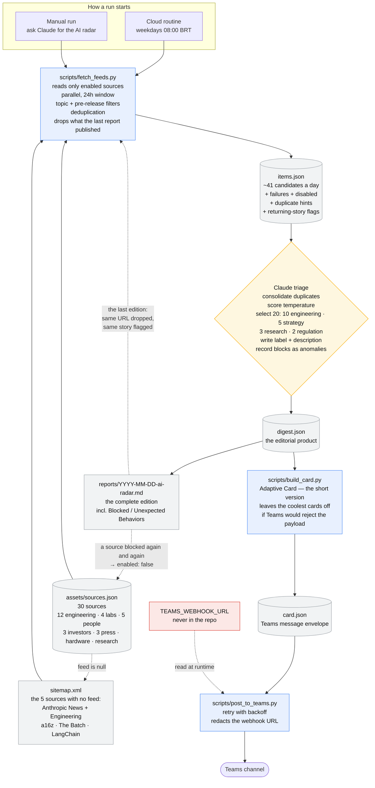

# claude-labs

A lab for Claude Code experiments. It currently holds one thing: **`ai-news-digest`**,
a daily radar on **software engineering with AI**, written for SiDi's AI strategy
committee.

Every weekday morning it collects the last 24 hours from a catalog of 30 sources, judges how
much each item matters, keeps the 20 that matter most, and publishes them as a
card newsletter in a Microsoft Teams channel.

The catalog has three groups. **The engineering core** — twelve sources, the
largest group and the reason the radar exists: LangGraph, harness engineering,
context engineering, prompt engineering, MCP, agent memory, guardrails, evals,
and the coding agents themselves. **Primary:** the labs (OpenAI, Anthropic,
Google), the people building them, investors, and NVIDIA. **Supporting:** press
and research, because the primary tier cannot report on itself — the labs
announce but do not analyse, the people publish on X which has no fetchable feed,
and the VC firms blog about portfolio companies rather than deals.

## Sources

The catalog as it stands, with what each source actually delivered. **d-1** is
the last 24 hours, **d-7** the last 7 days, both measured on 2026-09-03 and both
counted before deduplication — the same story from four outlets counts four
times here and becomes one card.

| `id`                    | Name                                    | Category    | How it is read          | d-1    | d-7     |
| ----------------------- | --------------------------------------- | ----------- | ----------------------- | ------ | ------- |
| `openai`                | OpenAI News                             | lab         | RSS/Atom                | 3      | 14      |
| `anthropic`             | Anthropic News                          | lab         | Sitemap                 | 0      | 6       |
| `deepmind`              | Google DeepMind Blog                    | lab         | RSS/Atom                | 1      | 4       |
| `google-ai`             | Google - The Keyword (AI)               | lab         | RSS/Atom                | 0      | 3       |
| `karpathy` †            | Andrej Karpathy                         | people      | RSS/Atom — retired      | 0      | 0       |
| `boris-cherny`          | Boris Cherny                            | people      | RSS/Atom                | 0      | 0       |
| `thariq`                | Thariq Shihipar                         | people      | RSS/Atom                | 0      | 0       |
| `the-batch`             | The Batch (Andrew Ng / DeepLearning.AI) | people      | Sitemap                 | 0      | 7       |
| `sam-altman`            | Sam Altman                              | people      | RSS/Atom                | 0      | 0       |
| `a16z`                  | Andreessen Horowitz                     | investor    | Sitemap                 | 0      | 0       |
| `ycombinator`           | Y Combinator Blog                       | investor    | RSS/Atom                | 0      | 0       |
| `sequoia`               | Sequoia Capital                         | investor    | RSS/Atom                | 0      | 0       |
| `nvidia`                | NVIDIA Blog                             | hardware    | RSS/Atom + topic filter | 2      | 3       |
| `nvidia-newsroom`       | NVIDIA Newsroom                         | hardware    | RSS/Atom + topic filter | 2      | 4       |
| `techcrunch-ai`         | TechCrunch AI                           | press       | RSS/Atom                | 7      | 19      |
| `the-decoder`           | The Decoder                             | press       | RSS/Atom                | 8      | 10      |
| `arstechnica-ai`        | Ars Technica AI                         | press       | RSS/Atom                | 2      | 10      |
| `latent-space`          | Latent Space                            | engineering | RSS/Atom                | 2      | 7       |
| `anthropic-engineering` | Anthropic Engineering                   | engineering | Sitemap                 | 0      | 0       |
| `langchain`             | LangChain Blog                          | engineering | Sitemap                 | 3      | 3       |
| `simon-willison`        | Simon Willison                          | engineering | RSS/Atom + topic filter | 1*     | 8*      |
| `github-ai`             | GitHub AI & ML Blog                     | engineering | RSS/Atom                | 1      | 3       |
| `infoq-ai`              | InfoQ AI, ML & Data Engineering         | engineering | RSS/Atom + topic filter | 1      | 12      |
| `huggingface`           | Hugging Face Blog                       | engineering | RSS/Atom + topic filter | 0      | 3       |
| `cursor`                | Cursor Changelog                        | engineering | RSS/Atom                | 0      | 1       |
| `zed`                   | Zed Blog                                | engineering | RSS/Atom                | 0      | 1       |
| `sourcegraph`           | Sourcegraph Blog                        | engineering | RSS/Atom                | 0      | 0       |
| `martin-fowler`         | Martin Fowler                           | engineering | RSS/Atom + topic filter | 0      | 3       |
| `arxiv-se`              | arXiv cs.SE (Software Engineering)      | research    | RSS/Atom                | 10*    | 10*     |
| `github-changelog`      | GitHub Changelog                        | engineering | RSS/Atom + topic filter | 3      | 5       |
| **Total**               | **30 sources**, 29 enabled              |             |                         | **46** | **136** |

`*` capped by the source's own `max_items`.

`†` **retired 2026-09-04**, the first use of `"enabled": false`, and a worked
example of what the mechanism is for. Karpathy's feed returned `403` on two
consecutive cloud runs with no `x-deny-reason` header — bearblog refusing the
request, not the environment's allowlist — while answering `200` from a laptop
with the same user agent, so the block is on the origin and there is nothing to
fix on our side. It had also published nothing in a measured 30-day window,
because he posts on X. Keeping it enabled meant a failure line in every
newsletter for a source that had never contributed an item, which is exactly how
readers learn to ignore failure lines. The row stays, with the evidence in its
`note`, so re-enabling is one word if either fact changes; `--only karpathy`
still reads it for testing.

The counts are a snapshot and drift. To take a fresh one:

```bash
python3 scripts/fetch_feeds.py --hours 24  --out /tmp/d1.json
python3 scripts/fetch_feeds.py --hours 168 --out /tmp/d7.json
# per source: sources_ok[].in_window in each file
```

### Twelve engineering sources, and why

The radar exists for one agenda — LangGraph, harness engineering, context
engineering, prompt engineering, MCP, agent memory, guardrails, Claude Code and
Codex — and until 2026-09-03 the catalog barely touched it. Measured over 30
days across the then-20 sources: **zero** items on LangGraph or LangChain, one on
MCP, one on context engineering, two on harness engineering. 44 items in a month,
1.5 a day, against a target of ten engineering cards a day.

Ten sources were added to close that, each validated live before it went in:

| Source | Why it is here | Volume |
| --- | --- | --- |
| Anthropic Engineering | The canonical source for this agenda: context engineering, harness design, agent skills, advanced tool use, Claude Code internals. Read from the same sitemap as Anthropic News, filtered to `/engineering/`. | ~1/month, and a HIGH card when it fires |
| LangChain Blog | The only source covering LangGraph, LangSmith and agent memory directly. | 3/day |
| Simon Willison | Daily hands-on practice with Claude Code, Codex and every new model. | 0.9/day |
| GitHub AI & ML | Copilot practice and evaluation writeups. 90% of its posts are on-agenda. | 0.3/day |
| InfoQ AI/ML | Production practice, edited for engineers. 86% on-agenda. | 0.5/day |
| Hugging Face | Agent memory, structured outputs, evaluation, with runnable code. | 0.9/day |
| Cursor Changelog | A coding agent's own changelog — the only one reachable from the sandbox. | 0.2/day |
| Zed, Sourcegraph | Editor and code-search agents. Quiet, on-topic when they fire. | 0.1/day each |
| Martin Fowler | LLM practice for software teams, for an audience that already reads him. | 0.3/day |

After the change, **19 of the 44 items in a 24h window are on that agenda**, up
from 1.5 a day. That is what makes ten engineering cards of twenty possible.

Two things the numbers still say plainly. **The people and the investors publish
almost nothing**: seven sources returned zero in a full week, because Karpathy,
Boris Cherny, Thariq and Sam Altman post on X, which has no fetchable feed, and
the VC firms blog about portfolio companies rather than deals. They stay because
when they do publish it is first-hand, and they cost nothing on a quiet day.
**The press still carries the general volume**: TechCrunch, The Decoder and Ars
Technica are 39 of the 136 weekly items.

The five sitemap sources publish no RSS at all; the topic filter is what keeps
NVIDIA's gaming beat, Hugging Face's model-release posts and Fowler's general
architecture writing out. `references/sources.md` has the reasoning per source,
the LangChain sitemap caveat, and how to add or fix one.

## Solution overview



The three blue boxes are deterministic Python. The yellow diamond is the only
step that needs judgment, and it is where Claude does the actual editorial work:
merging the same story across outlets and languages, deciding what is hot, and
writing each card. Everything around it is plumbing that either succeeds or
reports why it failed.

The dotted line from the archive back to the catalog is the slow loop: each
report records what was blocked or behaved oddly, and a source that keeps
appearing there earns an `"enabled": false`.

**Two artifacts, deliberately different lengths.** `digest.json` is the edition,
and every card in it reaches the archived report — that is the complete and
detailed record. The Teams card is a shorter view of the same edition: Microsoft
rejects a payload above ~28 KB, so if the edition does not fit, the coolest cards
are left off the card and its footer points at the report. The digest is never
modified, so nothing is lost, and editorial selection is never constrained by how
the card will render. The Teams layout is still to be designed; until then
"shorter" just means "as many as fit".

## Repository layout

| Path | What it is |
| --- | --- |
| `CLAUDE.md` | Project instructions Claude loads every session: what the skill is, the rules that must hold when changing it, the activation checklist, and the backlog. |
| `.claude/settings.json` | Pins the project to Claude Sonnet 5 — one file covering both an interactive session here and the cloud routine that clones the repo. A measured run costs $0.31; see `references/scheduling.md`. |
| `README.md` | This file. |
| `reports/` | Archive of published newsletters, one file per day as `YYYY-MM-DD-ai-radar.md`. What goes to Teams is the Adaptive Card; this is the readable record of it, because a Teams card stops being searchable after a few weeks. |
| `.claude/skills/ai-news-digest/` | The skill itself. |

### Inside the skill

| Path | What it is |
| --- | --- |
| `SKILL.md` | The entry point. Claude reads this to run the newsletter: the seven-step flow, the temperature rubric, the four committee lenses, and the writing rules. Everything else in the folder is referenced from here. |
| `assets/sources.json` | The source catalog, the base of truth for everything else in this repo, and the file you edit most. Each entry carries a feed or a sitemap, a weight, a language, and optional flags. `enabled: false` retires a source without deleting what was learned about it; `lang` decides the card's language; `kind: release` marks a version feed. When it changes, `CLAUDE.md`, this file, `SKILL.md` and `references/sources.md` change with it. |
| `assets/report-template.md` | Shape of the markdown newsletter archived in `reports/`, including the `Blocked / Unexpected Behaviors` section that the catalog decisions get made from. |
| `scripts/fetch_feeds.py` | Collector. Reads the sources marked `enabled`, fetches them in parallel, filters to the time window, drops off-topic items from general sources and alpha/beta/nightly builds from release feeds, deduplicates, and reports every failure — distinguishing a `403` from the network allowlist (`x-deny-reason`) from one where the source refused us. Identifies itself as `ai-news-digest/1.0`, never as a browser. Standard library only. |
| `scripts/build_card.py` | Renderer. Turns `digest.json` into a Teams Adaptive Card, validates the digest, and drops the coldest items if the card would exceed the Teams size limit. |
| `scripts/post_to_teams.py` | Publisher. POSTs to the channel webhook with retry and backoff, and redacts the URL from every line it prints. |
| `references/digest-schema.md` | The contract between triage and rendering: what `digest.json` must contain and how it is validated. |
| `references/sources.md` | Why each source is on the list, how to retire one without losing what was learned about it, how we identify ourselves to a server, how to fix a feed that moved, and how deduplication actually behaves. |
| `references/teams-delivery.md` | How to create the channel webhook, the payload format, and the limits the code handles for you. |
| `references/routine-prompt.md` | The scheduled routine's prompt. The routine stores its own copy on Anthropic's side, so this file is the versioned source of truth for it — the one part of the system that can drift silently. Deliberately thin: anything about the newsletter belongs in `SKILL.md`. |
| `references/scheduling.md` | Running it daily at 08:00 BRT: the cloud routine, plus local systemd and GitHub Actions as alternatives. Includes cost and the network setting that silently empties the newsletter if missed. |
| `evals/evals.json` | Eleven test cases. Six are mechanical; five judge editorial quality and need a human or an LLM judge. |
| `evals/run_script_evals.py` | Runs the six mechanical cases as 45 assertions over collection, the enabled filter, the previous-report filter, size trimming, digest validation, and secret handling. |
| `evals/fixtures/` | Sample `digest.json` and `card.json` used by those assertions. |

## Running it by hand

```bash
cd .claude/skills/ai-news-digest

python3 scripts/fetch_feeds.py --hours 24 --out /tmp/items.json --pretty
# read /tmp/items.json, triage it, write digest.json  <- Claude does this
python3 scripts/build_card.py --in digest.json --preview        # read it first
python3 scripts/build_card.py --in digest.json --out card.json
python3 scripts/post_to_teams.py --payload card.json --dry-run  # validates, sends nothing
python3 scripts/post_to_teams.py --payload card.json            # needs TEAMS_WEBHOOK_URL
```

In practice you just ask Claude for the AI radar and it walks the whole flow.

Run the checks with:

```bash
python3 evals/run_script_evals.py            # 45 assertions
python3 evals/run_script_evals.py --offline  # skips the one that hits the network
```

## Conventions

- **The webhook URL is a credential.** It lives in `TEAMS_WEBHOOK_URL`, or in the
  file named by `TEAMS_WEBHOOK_FILE`. Never in a repository file, a log, a commit
  or a reply.
- **Standard library only.** The VM has no `pip` and the cloud environment may
  not either, so the scripts add no dependencies.
- **The last edition is not published twice.** An item whose canonical URL was
  already published is dropped and counted; one whose title merely resembles a
  published title is flagged for triage, never dropped — a story that comes back
  usually comes back because something changed.
- **A source that failed is reported, never hidden.** The reader has to know when
  a collection was partial. Blocks and oddities also get their own section in the
  archived report — `Blocked / Unexpected Behaviors`, always rendered, saying
  "None." on a clean run — recording what happened *and what it means*, since
  that is the evidence a source gets retired on.
- **We identify ourselves honestly.** The collector sends
  `ai-news-digest/1.0 (+<repo>; SiDi AI Radar feed reader)`, never a browser
  string. It reads public feeds that sites publish to be read, once a day, one
  request each. If a source blocks that user agent it becomes a declared failure
  or it leaves the catalog — never a spoofed UA, a rotated IP or a proxy.
- **Retire a source, don't delete it.** `"enabled": false` keeps the entry and
  the reasoning that took work to establish; the collector skips it and counts it
  under `sources_disabled`, so `28/28` is never quietly `28/30`.
- **The report is complete; the card is short.** Selection is never limited by
  the Teams payload size. Every selected card reaches `reports/*.md`; the card
  shows what fits and links to the rest.
- **Only triage spends model tokens.** Collection, card building and posting are
  deterministic Python. A measured run is 15 turns and 17.5K output tokens —
  $0.31 on Sonnet 5, $0.78 on Opus 5 — and the cost is dominated by the
  conversation being re-read each turn, not by the newsletter.
- **The quiet feeds win ties.** Latent Space, GitHub Changelog and `arXiv cs.SE`
  publish far less than the AI press, so the triage step targets a share of
  engineering items — ten of the twenty — rather than picking by volume or
  recency.
- **English everywhere**, with one exception: cards whose main source is a
  Brazilian outlet keep their title and description in Portuguese, because they
  are local-market stories written for that market. No `pt-BR` source is in the
  catalog today, so the rule is currently inert.

## Status

**Scheduled and running.** The routine `AI Radar (archive)` fires weekdays at
08:00 BRT (`0 11 * * 1-5` UTC) on the `Full Access` environment, on Claude
Sonnet 5, cloning this repo each run. Verified on 2026-09-04: 29/30 sources
answered through the environment's allowlist, and the run committed
`reports/2026-09-04-ai-radar.md` to `main` on its own.

**One step short of live.** No Teams webhook is configured, so the routine runs
in archive-only mode: it collects, triages, validates the payload with
`--dry-run`, and pushes the markdown report — but publishes nothing to the
channel. Creating the webhook is the last step; see **Not live yet** in
`CLAUDE.md` and `references/teams-delivery.md`.
